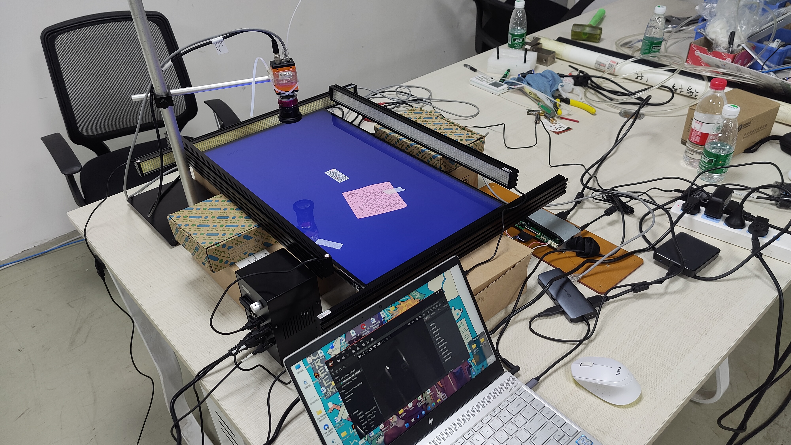
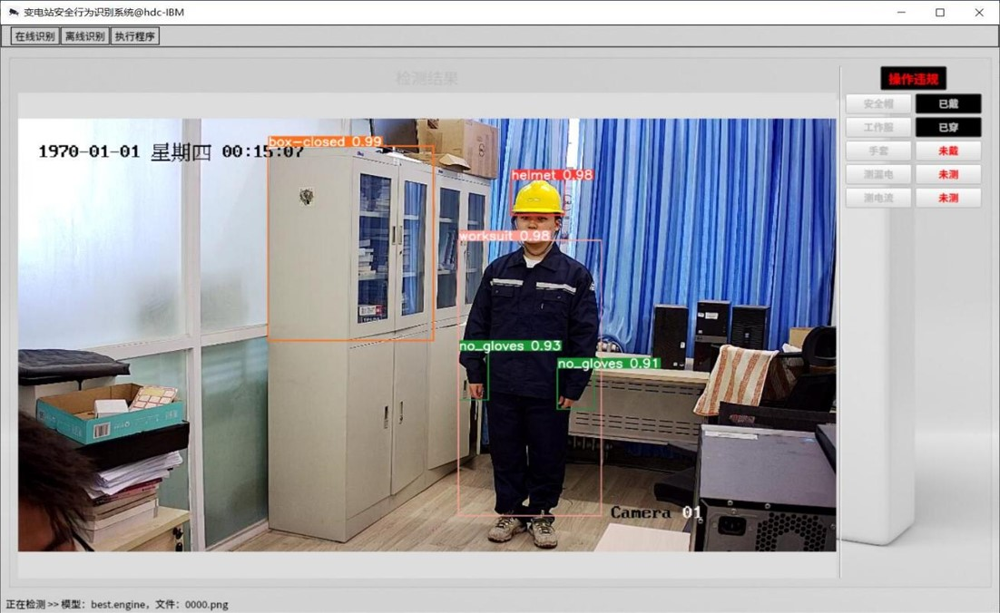
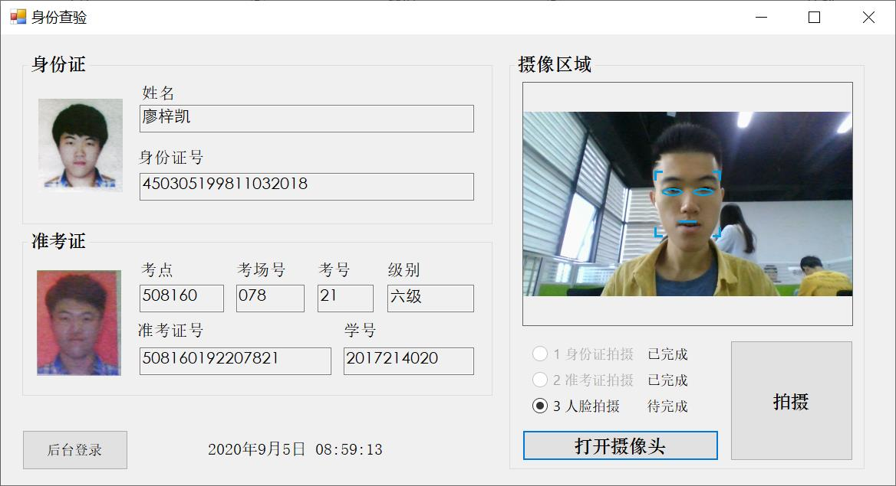
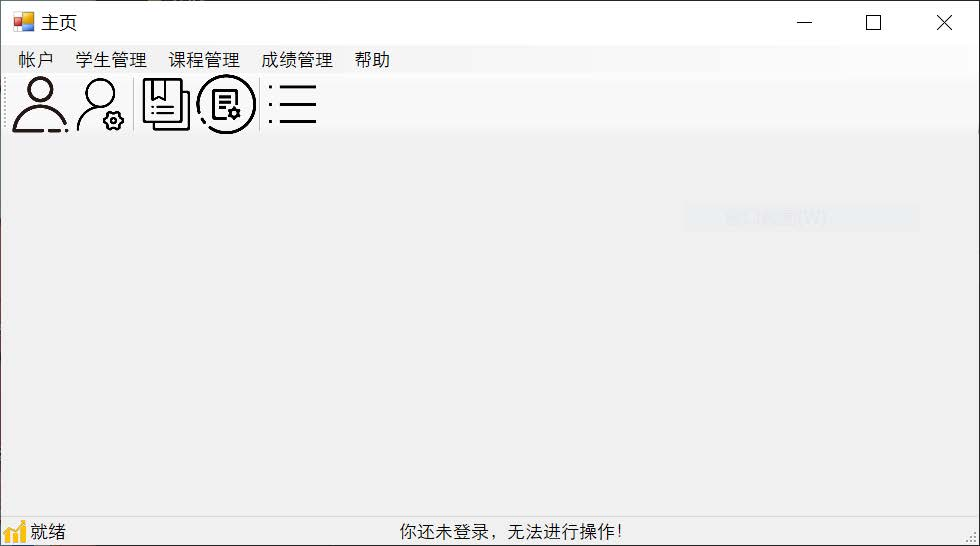

## About me 🧑
  * Postgraduate student
  * Software Engineering Institute
  * Xidian University
  * No. 266, Xifeng Road, Changan District (<a href="https://maps.app.goo.gl/bBHEYsU7xCEoXxbD6" style="text-decoration:none;color:#20B2AA">Google Map</a> / <a href="https://surl.amap.com/NH7NTK1eeIb" style="text-decoration:none;color:#20B2AA">高德地图</a>)

---

## News 📰
- *2024.04* - Excellent graduate student of the 2023-2024 academic year.
- *2024.04* - **Officially admitted to the Computer Science PhD program at Stony Brook University.**
- *2024.01* - Selected as the reviewer for ACM MM 24.
- *2023.10* - Excellent graduate student of the 2022-2023 academic year.
- *2023.10* - Poster presentation of my ACM MM 23 paper.
- *2023.10* - I won a national scholarship for postgraduate students in the 2022-2023 school year.
- *2023.07* - One paper was accepted to be appeared on ACM MM 23.

---

## Educations 🎓

**Xidian University**, Xi'an, China - 09/2021~06/2024 (expected)
- Major: Software Engineering
- Degree: Master of Engineering (expected)
- Research Interest: Computer Vision, Image Analysis, Image Processing

**Chongqing University of Posts and Telecommunication**, Chongqing, China - 09/2017~06/2021
- Major: Software Engineering
- Degree: Bachelor of Engineering
- Software Engineering with English, School of Software Engineering

---

## Publications 📃

**DANet: Multi-scale UAV Target Detection with Dynamic Feature Perception and Scale-aware Knowledge Distillation** - *ACM Multimedia (ACMMM)*, 2023  👉[Paper](../files/2023_ACMMM.pdf),<a href="https://dl.acm.org/doi/10.1145/3581783.3612146" style="text-decoration:none;">Online page</a>  
Houzhang Fang, **Zikai Liao**, Lu Wang, Qingshan Li, Yi Chang, Luxin Yan, Xuhua Wang

**Differentiated Attention Guided Network over Hierarchical and Aggregated Features for Intelligent UAV Surveillance** - *IEEE Transactions on Industrial Informatics (TII)*, 2023  👉[Paper](../files/2023_TII.pdf),<a href="https://ieeexplore.ieee.org/document/10018470" style="text-decoration:none;">Online page</a>  
Houzhang Fang, **Zikai Liao**, Xuhua Wang, Yi Chang, Luxin Yan

**Prior-BERT and Multi-task Learning for Target-aspect-sentiment Joint Detection** - *2022 IEEE International Conference on Acoustics, Speech and Signal Processing (ICASSP)*, 2022  👉[Paper](../files/2022_ICASSP.pdf),<a href="Prior-BERT and Multi-task Learning for Target-aspect-sentiment Joint Detection" style="text-decoration:none;">Online page</a>  
Cai Ke, Qingyu Xiong, Chao Wu, **Zikai Liao** Hualing Yi

---

## Projects 🛠️

<table frame=void border="0">
  <tbody>
    <tr>
      <td width="40%">
        
      </td>
      <td width="60%">
        <b>Automatic Defect Detection for PC Displays</b> 
        Design a hardware and software system for automatic defect detection for PC displays on assembly lines. Defect types include dirt, dust, hair, broken pixel, mura (contrast inconsistency), light leaking, etc. The preliminary test was passed on August 2023 at Chuntex Elite Technology.
      </td>
    </tr>
    <tr>
      <td>
        
      </td>
      <td>
        <b>Behavioral Safety Identification System for Substation Workers</b> 
        Based on camera footage, we designed a software platform to identify substation workers' behavior to ensure safety regulations, including wearing the worker uniform and the helmet, opening the electrical box with the correct gadgets, and operating the devices with appropriate actions. I completed this project on September 2022.
      </td>
    </tr>
    <tr>
      <td>
        
      </td>
      <td>
        <b>Exam ID & Face Recognition System based on OpenCV</b> 
        The course project for "Comprehensive Software Development Practice". The goal of this project is to identify exam taker's ID by jointly matching his/her face with information recorded in the database.
      </td>
    </tr>
    <tr>
      <td>
        
      </td>
      <td>
        <b>Student Information Management System based on .Net C#</b> 
        The course project for "Software Development (3) (.NET Platform)". It aims to build a system to manage student information, including adding, searching, modifying, and deleting.
      </td>
    </tr>
  </tbody>
</table>

---

## Misc 💡
- My hometown is Guilin ([Google Maps](https://maps.app.goo.gl/Ne281Q9Kp1wXt4Qu5), [Wikipedia](https://en.wikipedia.org/wiki/Guilin)), a beautiful city with stunning natural landscapes of karst topography ⛰️ 🏞.
- I am addicted to music 24/7 🎵🎶 without music I think I might die. I sometimes record and edit music for fun, and hope to learn more about music production.
- Amateur photography enthusiast 📷. I find my surroundings always worthy of a picture taken because I believe everything is beautiful in its own way. When I purchase a new phone, its camera capacity is one of my focuses.
- I was a dancer when I was young 🕺. Even though I don't dance like before nowadays, I am still looking forward to reinvigorating my passion for dancing.
- I love city walking 🚶! I have a goal that I want to explore every corner of each city I spend time living in. Yes, those fancy malls and tourist attractions excite me and I love them dearly, but usually I would like to walk into the quiet alley and observe the ordinary life of ordinary people.
- I love experiencing new stuff 🤩! Concerts, live houses, exhibitions, operas, musicals, movies, hiking, biking... anything!
